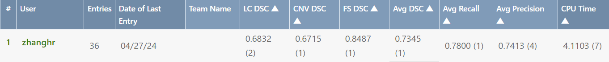

# MICCAI MMAC 2023 - Task 2

## Competition Result
- 我们上传的模型指标最终为 **dice = 0.7345**，在`Future Test Phase - Task 2`中位列**第一名**
- 并且，我们超过了正式比赛期间`Test Phase - Task 2`上传的模型指标的第一名(**dice = 0.7264**)
- 下面是比赛结果截图，其中`Avg DSC`是平均 dice 分数，用于最终的排名

## Run

### Training
- 下载数据集，比如将`training`和`validation`数据集到本文件夹，重命名为`Data1`和`Data2`，如`.../MMAC/Data1/2. Segmentation...`
- 超参修改
  - `scripts/train.sh`
  - `src/param.py`
  - `src/utils.py`
- 开始训练
  - `bash scripts/train.sh`
- 会生成`model`和`result`文件夹，分别保存模型参数、训练结果

### Upload
- 将模型参数文件`.pth`放到`upload/upload_model/`中，三个不同的数据集分别放到对应的文件夹中
- 运行`bash test.sh`检查正确性
- 将下列文件/文件夹打包，如`upload_1.zip`
  - `upload_model/`
  - `metadata`
  - `model.py`
- 进入比赛网站 [MMAC](https://codalab.lisn.upsaclay.fr/competitions/12476#participate-submit_results)
- 进入`future test phase`中，上传`zip`文件

### Grid Search
- 进行网格搜索
  - `python src/gridsearch.py`

## Reference Paper
- `Ensemble Deep Learning Approaches for Myopic Maculopathy Plus Lesions Segmentation` 
- `A Clinically Guided Approach for Training Deep Neural Networks for Myopic Maculopathy Classification`
- `Automated Detection of Myopic Maculopathy in MMAC 2023: Achievements in Classification, Segmentation, and Spherical Equivalent Prediction`

## Record
- `v0.1`
  - 上传项目文件
  - 添加`upload`文件夹，用于测试
- `v0.2`
  - 网格搜索
- `v0.3`
  - 添加多种网络，修改部分代码
- `v0.4`
  - 修复`smp`包的一个`bug`，只有`import segmentation_model_pytorch.utils`之后才能使用`smp.utils`
- `v0.5`
  - 修复`upload/model.py`的路径问题
- `v1.0`
  - 整理文件夹，完善代码